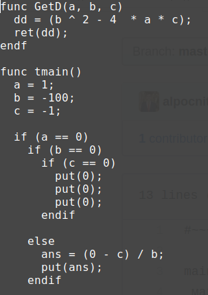

# Язык на основе рекурсивного спуска, с оператором взятия производной!

На этой картинке представлена работа всего проекта, который был сделан в 1 семестре обучения в МФТИ. 

### Program

### Funny program

### Tokenized program

### .tree

### .ams

#### frontend.cpp
С помощью лексического анализа я превращаю слова из [program](../Recursive/Programs/program) в токены. Далее токены с помощью рекурсивного спуcка я превращаю в дерево (.tree). Если в дереве есть оператор взятия производной, то я беру ее и упрощаю ответ. 
#### backend.cpp
И дерево далее интерпретируется в мой ассемблер (.ams).
#### Processor
Ассемблер исполняется моим [эмулятором процессора](../Processor)

Мой язык имеет 2 формы. Смешную и нормальную. Смешная форма, например, [здесь](../Recursive/Programs/funny_program). Нормальная форма: [здесь](../Recursive/Programs/equation). Формы можно переводить друг в друга

## Примеры программ

* [deriv](../Recursive/Programs/deriv) - программа демонстрирует возможность взятия производной
* [equation](../Recursive/Programs/equation) - решение квадратного уравнения
* [factorial](../Recursive/Programs/factorial) - возвращает факториал числа
* [give_square](../Recursive/Programs/give_square) - возвращает квадрат числа
* [lot_variables](../Recursive/Programs/lot_variables) - создание переменной в моем языке
* [funny_program](../Recursive/Programs/funny_program) - смешное расширение языка

## Обозначения
* .ams - Программа, написанной на моем ассемблере
* .tree - Дерево
* program, collect_program... - Программы, написанные на моем языке программирования
---
###### For debug: freed.debug - список всей освобожденной памяти
###### For debug: calloced.debug - список всей выделенной памяти
---
* [language.h](../Recursive/language.h) - Главный header file языка
---
* [funny_language.h](../Recursive/funny_language.h) - Таблица переводов из нормального языка в смешной
* [funny_normal.cpp](../Recursive/funny_normal.cpp) - **FROM** Смешная форма (Programs/funny_program) **TO** Нормальная форма (Programs/program)
* [normal_funny.cpp](../Recursive/normal_funny.cpp) **FROM** Programs/program **TO** Programs/funny_program

#### Таблица перевода

`Петрович написал`&nbsp;&nbsp;&nbsp;&nbsp;&nbsp;&nbsp;&nbsp;&nbsp;&nbsp;&nbsp;&nbsp;-> while \
`осознаю`&nbsp;&nbsp;&nbsp;&nbsp;&nbsp;&nbsp;&nbsp;&nbsp;&nbsp;&nbsp;&nbsp;&nbsp;&nbsp;&nbsp;&nbsp;&nbsp;&nbsp;&nbsp;&nbsp;&nbsp;&nbsp;&nbsp;&nbsp;&nbsp;&nbsp;&nbsp;&nbsp;&nbsp;-> endwhile \
 \
`овчос_разобрал`&nbsp;&nbsp;&nbsp;&nbsp;&nbsp;&nbsp;&nbsp;&nbsp;&nbsp;&nbsp;&nbsp;&nbsp;&nbsp;&nbsp;&nbsp;&nbsp;-> if \
`придется_катать`&nbsp;&nbsp;&nbsp;&nbsp;&nbsp;&nbsp;&nbsp;&nbsp;&nbsp;&nbsp;&nbsp;&nbsp;&nbsp;&nbsp;-> else \
`ладно,забью`&nbsp;&nbsp;&nbsp;&nbsp;&nbsp;&nbsp;&nbsp;&nbsp;&nbsp;&nbsp;&nbsp;&nbsp;&nbsp;&nbsp;&nbsp;&nbsp;&nbsp;&nbsp;&nbsp;&nbsp;&nbsp;-> endif \
 \
`лаба`&nbsp;&nbsp;&nbsp;&nbsp;&nbsp;&nbsp;&nbsp;&nbsp;&nbsp;&nbsp;&nbsp;&nbsp;&nbsp;&nbsp;&nbsp;&nbsp;&nbsp;&nbsp;&nbsp;&nbsp;&nbsp;&nbsp;&nbsp;&nbsp;&nbsp;&nbsp;&nbsp;&nbsp;&nbsp;&nbsp;&nbsp;&nbsp;&nbsp;-> func \
`подгони_это`&nbsp;&nbsp;&nbsp;&nbsp;&nbsp;&nbsp;&nbsp;&nbsp;&nbsp;&nbsp;&nbsp;&nbsp;&nbsp;&nbsp;&nbsp;&nbsp;&nbsp;&nbsp;&nbsp;&nbsp;-> ret \
`пипец,лаба_кончилась`&nbsp;&nbsp;&nbsp;-> endf \
\
`сдать_домашку`&nbsp;&nbsp;&nbsp;&nbsp;&nbsp;&nbsp;&nbsp;&nbsp;&nbsp;&nbsp;&nbsp;&nbsp;&nbsp;&nbsp;&nbsp;&nbsp;&nbsp;-> put (вывод) \
`мат_помощь`&nbsp;&nbsp;&nbsp;&nbsp;&nbsp;&nbsp;&nbsp;&nbsp;&nbsp;&nbsp;&nbsp;&nbsp;&nbsp;&nbsp;&nbsp;&nbsp;&nbsp;&nbsp;&nbsp;&nbsp;&nbsp;&nbsp;-> get (ввод) \
`мешал_пиво_с_водкой`&nbsp;&nbsp;&nbsp;&nbsp;&nbsp;&nbsp;-> + \
`забил_на_физику`&nbsp;&nbsp;&nbsp;&nbsp;&nbsp;&nbsp;&nbsp;&nbsp;&nbsp;&nbsp;&nbsp;&nbsp;&nbsp;-> -(минус) \
`не_погладил_полторашку`&nbsp;-> * \
`не_пришел_на_коллок`&nbsp;&nbsp;&nbsp;&nbsp;&nbsp;&nbsp;-> /(деление) \
`_проспал_сессию_`&nbsp;&nbsp;&nbsp;&nbsp;&nbsp;&nbsp;&nbsp;&nbsp;&nbsp;&nbsp;&nbsp;-> ^ (возведение в степень) \
`поставить_удос_за`&nbsp;&nbsp;&nbsp;&nbsp;&nbsp;&nbsp;&nbsp;&nbsp;&nbsp;-> = \
`не_сдал_процессор`&nbsp;&nbsp;&nbsp;&nbsp;&nbsp;&nbsp;&nbsp;&nbsp;&nbsp;-> deriv (взятие производной) \
\
`выхожу_в_академ`&nbsp;&nbsp;&nbsp;&nbsp;&nbsp;&nbsp;&nbsp;&nbsp;&nbsp;&nbsp;&nbsp;&nbsp;-> endp

---
* [backend.cpp](../Recursive/backend.cpp) - **FROM** HelpFiles/frontend.tree **TO** HelpFiles/tree.ams
* [frontend.cpp](../Recursive/frontend.cpp) - **FROM** Programs/program **TO** HelpFiles/frontend.tree
* [frontend_back.cpp](../Recursive/frontend_back.cpp) - **FROM** HelpFiles/frontend.tree **TO** Programs/collect_program
* [middleend.cpp](../Recursive/middleend.cpp) - Выполняет оператор deriv (взятие производной) и упрощает результат. Используется в [frontend.cpp](../Recursive/frontend.cpp)
* [lexical_analysis.cpp](../Recursive/lexical_analysis.cpp) - **FROM** Програма **TO** Дерево. Используется в [frontend.cpp](../Recursive/frontend.cpp)
---
* [tree.cpp](../Recursive/tree.cpp) - функции для работы с деревом
