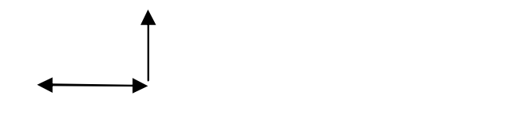
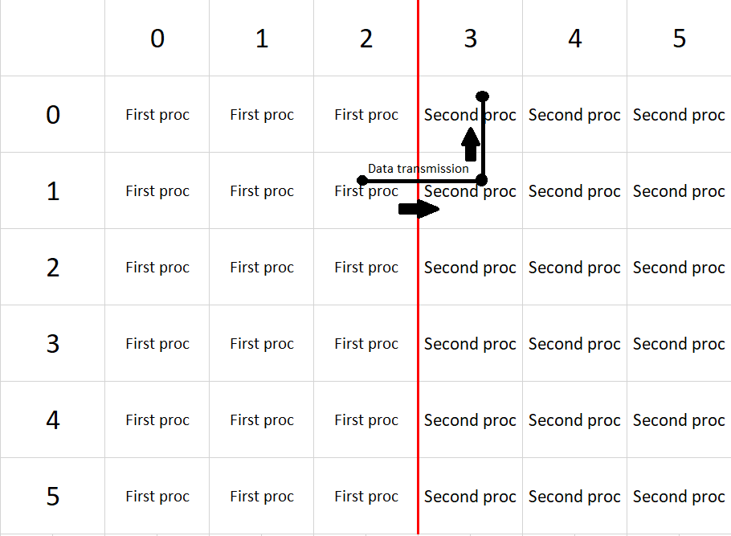
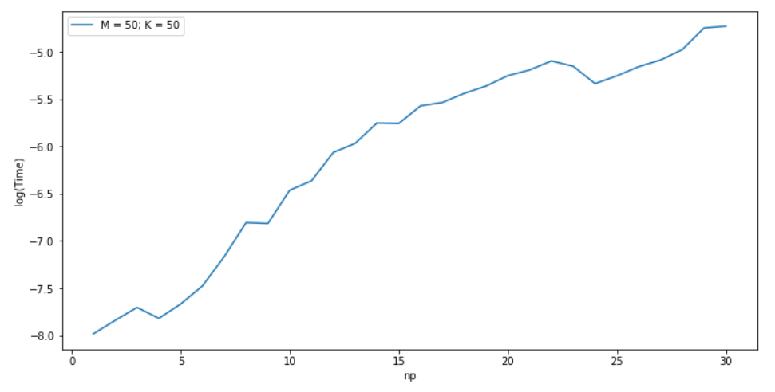
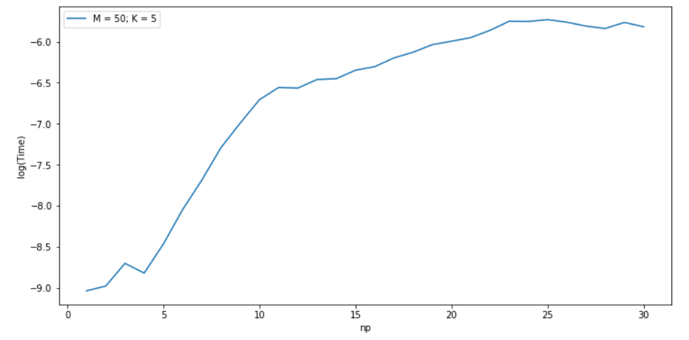
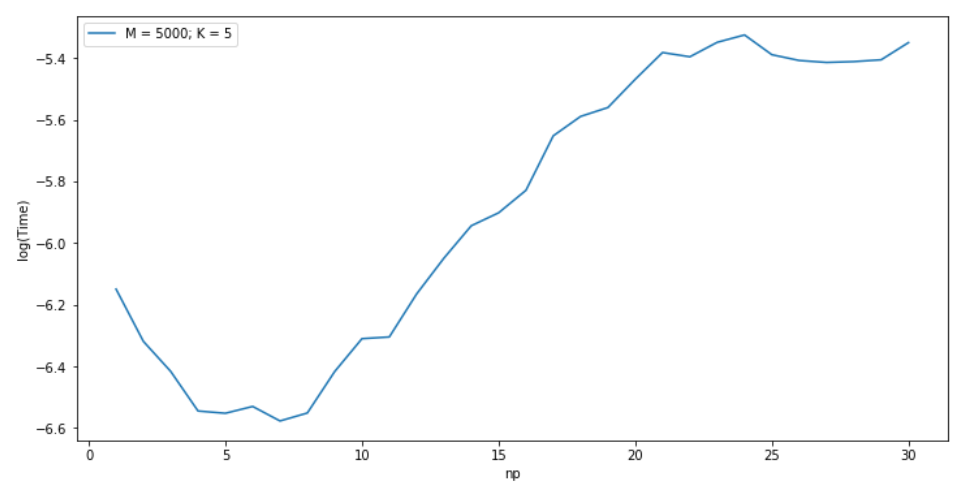
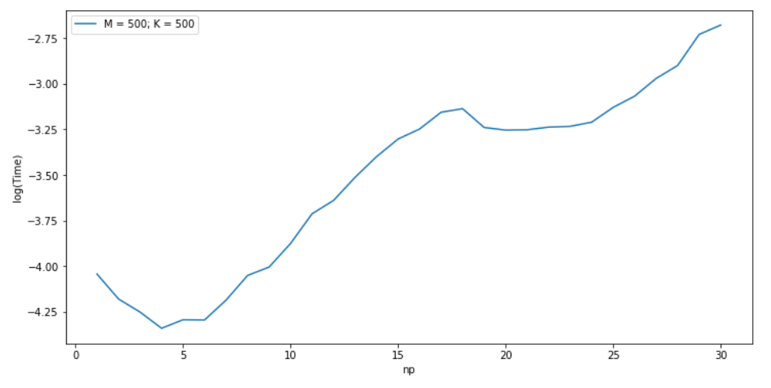
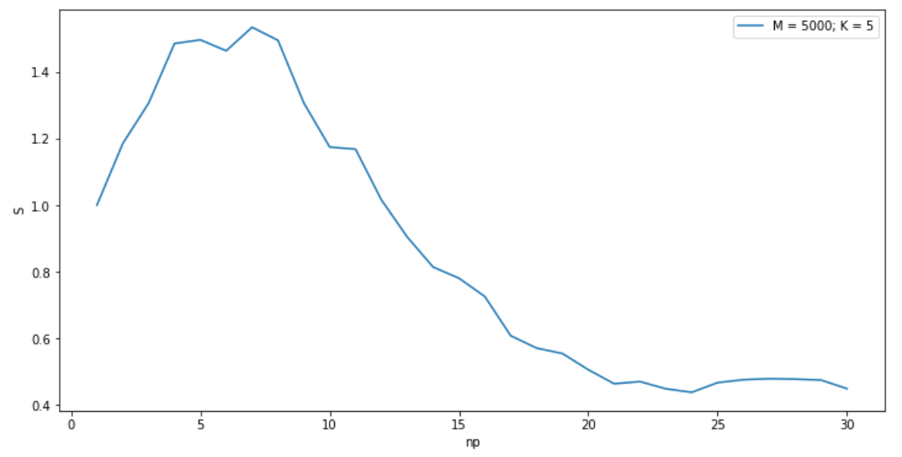
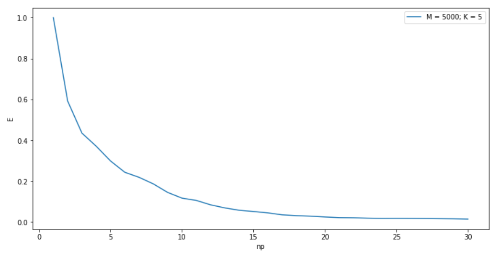

```diff
Works only with white themes
```

# Parallel calculations laboratory

## Task
The main task of this laboratory work is the development and study of a parallel program that searches for a numerical solution for differential equation:


## Method of soultion

In order to solve equation, we constract a uniform grid and function u(t,x) is considered in:


We will use "Explicit left corner" difference scheme:



Formula: 

## Programming
This equation solved using MPI library.

Let's look at the solution matrix that program calculates:
```
make 
make run np=1 K=5 M=5
```
It will output this matrix:
```
            0     1     2     3     4     5
      ------------------------------------------
0     |     0     4     2e+01 4e+01 6e+01 1e+02
      |
1     |     -2    0     4     2e+01 4e+01 6e+01
      |
2     |     2     -3    -3    8     2e+01 3e+01
      |
3     |     -1    -1    -8    5     7     9
      |
4     |     -0.6  -6    -9    3     3     -3
      |
5     |     2     -7    -2e+016     0.8   -1e+01
      |


Time: 0.000115267
```
- np - Number of process 
- K - Height of the matrix
- M - Widht of the matrix

Let's solve this equation using two processors:
```
make run np=2 K=5 M=5
```
Output:
```
            0     1     2     3     4     5
      ------------------------------------------
0     |     0     4     2e+01 4e+01 6e+01 1e+02

1     |     -2    0     4     2e+01 4e+01 6e+01
      |
2     |     2     -3    -3    8     2e+01 3e+01
      |
3     |     -1    -1    -8    5     7     9
      |
4     |     -0.6  -6    -9    3     3     -3
      |
5     |     2     -7    -2e+016     0.8   -1e+01
      |


Time: 0.00134599
      |                                          
```
Output is the same except for the sequence of style characters: | 

So, time with two processors is 0.00134599s, while time with one proc is 0.000115267s. Why is the time with two processors 10 times longer than the time with one processor? Because program on two processors divides matrix into 2 equal parts with width=3 and height=6, and the most part of time is consumed by MPI Send and Receive functions between this parts!




Let's do more experiments.

In order to disable output we have to comment ```#define PRINT``` line in __main.cpp__. After commenting this line we can measure time needed to calculate big matrices.

## Experiment

In these pictures you can see graphs that demonstrate the dependence of time on the number of processors with small width.





From these graphs, we can conclude that the increase in program parallelism lead to increase in time! This is because program has low level of parallelism. Each processor is given a small width, one processor is assigned a small amount of work, but a large amount of data transmissions.

In these pictures you can see graphs that demonstrate the dependence of time on the number of processors with small width.





From these graphs, we can conclude that there is an optimal number of processors equal to ~5 processors. When the number of processors is equal to the optimal number, the program time is the smallest. When the number of processors is less than optimal, the time is longer. This is because the program runs faster when the work is shared across processors and computed in parallel. But the time of a program running on more than optimal processors is also bigger than the time on the optimal number of processors. This is because an increase in the number of processors leads to a decrease in the number of calculations for each process, while the number of data transmissions increases.

## Effectiveness

-  time it takes for one processor to complete a job
-  time it takes for  processors to complete a job
-  - algorithm acceleration
-  - algorithm effectiveness

Maximal theoretical acceleration is equal to


Where  is the proportion of consecutive commands.

In experiment we measured dependence of  and  on number of processors for M=5000 and K=5 matrix





The maximum acceleration takes place at np ~ 5 processors, S = 1.5. The maximum effectiveness takes place at np = 1 processor.
